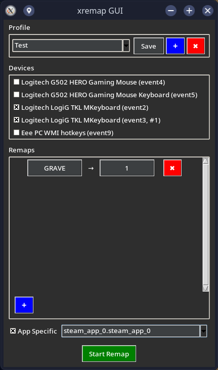

# xremap GUI

A graphical user interface for configuring and managing key and mouse remappings using xremap on Linux systems.

## Overview
xremap_gui provides an intuitive GUI to create, save, load, and delete profiles with custom keybindings, select input devices, and apply remappings for specific applications.

## Screenshots

## Prerequisites

### Software Dependencies

Python 3: Required to run the script.
bash
python3 --version

Tkinter: Python's standard GUI library (usually included with Python).
bash
python3 -c "import tkinter"

PyYAML: For handling YAML configuration files.
bash
pip3 install pyyaml

xremap: The key remapping tool.
bash
xremap --version
Install: xremap GitHub

wmctrl: For listing open windows to populate app-specific WM_CLASS values.
bash
wmctrl --version
Install: sudo apt install wmctrl (Ubuntu/Debian) or equivalent.

xprop: For querying window properties (WM_CLASS) for app-specific remappings.
bash
xprop --version
Install: sudo apt install x11-utils (Ubuntu/Debian) or equivalent.

libinput: For listing input devices.
bash
libinput list-devices
Install: sudo apt install libinput-tools (Ubuntu/Debian) or equivalent.

System Requirements

Linux with X11: Required for wmctrl and xprop to list and query window properties.
User Permissions: User must be in the input group to access input devices without sudo.
bash
groups | grep input
Add user: sudo usermod -aG input $USER and log out/in.
Write Permissions: Ensure write access to /home/$USER/.config/xremap_gui/ for profiles and configurations.

Installation

bash
pip install -r requirements.txt
python src/xremap_gui/remap.py

Usage
Run the GUI to create, save, load, and delete profiles with custom keybindings, select input devices, and apply remappings for specific applications.
